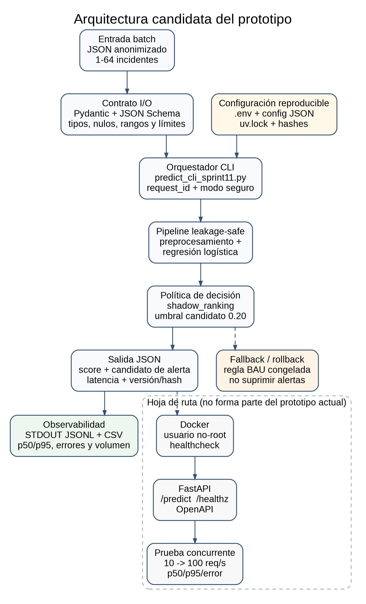

# Plan de despliegue mínimo - Sprint 11

**Proyecto:** Aplicación de modelos de IA para la detección proactiva de fallas físicas en infraestructura de red NOC  
**Autor:** Fernando Joel Blaz Aleman  
**Versión:** sprint11-deployment-plan-v1  
**Modo candidato actual:** módulo/CLI local y batch  
**Modo futuro:** API FastAPI contenerizada

## 1. Resumen ejecutivo

El avance transforma el pipeline experimental en un prototipo corrible, trazable y seguro para laboratorio. La arquitectura seleccionada para esta etapa es un módulo CLI porque el flujo actual corresponde a analítica interna y lotes controlados; evita introducir prematuramente red, servidor HTTP y orquestación. El artefacto `sprint10-logreg-leakage-safe-v1` se carga una vez por proceso, recibe únicamente variables disponibles al abrir el incidente, valida tipos y rangos mediante Pydantic y devuelve score, candidato de alerta, latencia y versión del modelo. El modo predeterminado es `shadow_ranking`: el modelo ordena casos, pero no suprime ni reemplaza las alertas BAU.

La clase real positiva se define como **incidente que efectivamente incumple el OLA**; la alerta es una predicción positiva. La matriz de confusión mostró que el umbral original 0.245 reducía falsas alarmas, pero aumentaba falsos negativos de 19 a 54 y disminuía el recall de 97.35% a 92.46%. Por ello, no se propone un reemplazo autónomo. Se incorpora un umbral candidato recall-first de 0.20 que, en el holdout ya observado, produce 18 falsos negativos y recall de 97.49%; al ser una corrección posterior al feedback, debe revalidarse en una ventana temporal nueva. El plan conserva rollback inmediato a la regla BAU, contratos I/O versionados, lockfile, Makefile, prueba E2E, smoke/golden tests, logs JSONL y métricas CSV. El paso a Docker/API queda condicionado a validación concurrente, percepción real del stakeholder y aceptación explícita del costo de falsos negativos.

## 2. Arquitectura candidata

Se selecciona **módulo CLI/batch** para el prototipo actual. La API queda en la hoja de ruta.



Flujo actual:

1. Operador o proceso batch prepara un JSON de incidentes anonimizados.
2. Pydantic valida esquema, tipos, nulos, rangos y tamaño máximo del lote.
3. El CLI carga configuración segura y el artefacto `joblib` precargado.
4. El pipeline realiza preprocesamiento e inferencia.
5. La política `shadow_ranking` devuelve score y prioridad sin modificar la decisión BAU.
6. Se registran request_id, versión, hash, tamaño, latencia, resultado y error.

## 3. Contratos I/O

### 3.1 Entrada

El contrato completo está en `contracts/predict_request_schema_sprint11.json`. Incluye nueve variables categóricas y nueve numéricas disponibles al abrir el incidente. Se bloquean duración final, tiempos de resolución, fecha de cierre y `label_source` para evitar target leakage.

```json
{
  "request_id": "req-e2e-sprint11-001",
  "decision_mode": "shadow_ranking",
  "threshold": 0.20,
  "records": [{
    "domain": "IP",
    "area": "IPNOC",
    "priority": "CRITICAL",
    "type_of_incident": "FIBRA",
    "trouble_type": "ATTENUATION",
    "incident_type": "CABLE BROKEN ACCESS",
    "network_id": "network_005",
    "reason_group": "attenuation",
    "branch_id": "branch_001",
    "year": 2026,
    "quarter": 3,
    "month": 7,
    "week_of_year": 29,
    "day_of_week": 4,
    "hour": 11,
    "is_weekend": 0,
    "is_night": 0,
    "sla_threshold_hours": 15.0
  }]
}
```

### 3.2 Salida

```json
{
  "request_id": "req-e2e-sprint11-001",
  "status": "ok",
  "positive_class_definition": "INCUMPLE_OLA",
  "prediction_positive_definition": "CANDIDATO_ALERTA",
  "decision_mode": "shadow_ranking",
  "model_version": "sprint10-logreg-leakage-safe-v1",
  "model_sha256": "...",
  "batch_size": 1,
  "total_latency_ms": 9.2,
  "slo_p95_target_ms": 150.0,
  "predictions": [{
    "record_index": 0,
    "risk_score": 0.42,
    "predicted_positive": true,
    "decision": "PRIORIZAR_PARA_REVISION",
    "ranking_band": "ALTA",
    "threshold": 0.20,
    "latency_ms": 8.1
  }],
  "generated_at_utc": "2026-07-17T12:00:00Z"
}
```

### 3.3 Error controlado

Los errores de contrato retornan `INPUT_VALIDATION_ERROR`; no se contabilizan como error interno 5xx. Ejemplos disponibles:

- válido: `examples/input_valid_sprint11.json`;
- inválido: `examples/input_invalid_sprint11.json`;
- borde/categorías nuevas: `examples/input_boundary_sprint11.json`.

## 4. Reproducibilidad

- Semilla fija: `42`.
- Python objetivo: `3.13.x`.
- Dependencias exactas: `requirements-sprint11.lock.txt`.
- Lockfile de UV: `uv.lock`.
- Configuración versionada: `config/deployment_sprint11.json`.
- Variables de entorno documentadas: `.env.example`.
- Hash SHA-256 del modelo y datos: `artifacts/deployment_manifest_sprint11.json`.
- Comandos: `Makefile`.

```bash
make setup
make schemas
make predict
make test
make e2e
```

## 5. E2E en limpio

1. Clonar la rama y entrar a la raíz.
2. Crear un entorno Python 3.13.
3. Ejecutar `make setup` o `uv sync --frozen`.
4. Verificar que exista `artifacts/actual_logreg_sprint10.joblib`.
5. Ejecutar `make e2e`.
6. Revisar `results/e2e_summary_sprint11.json`.

Criterio de éxito: exit code 0, salida conforme al esquema, dos predicciones, scores en [0,1], hash correcto, modo `shadow_ranking`, definición explícita de la clase positiva y coincidencia con el golden dentro de tolerancia.

## 6. Observabilidad

- JSONL: `logs/inference_sprint11.jsonl`.
- Métricas CSV: `logs/inference_metrics_sprint11.csv`.
- Campos: timestamp UTC, request_id, estado, modo, batch, latencia total/media, versión, hash, umbral y código de error.
- Métricas ya observadas en laboratorio: p50 7.92 ms, p95 9.92 ms y 123.8 req/s para batch 1 con modelo precargado.
- La concurrencia HTTP aún no está medida; los req/s secuenciales no equivalen a solicitudes simultáneas.

## 7. Validación y tests

- **Smoke válido:** carga modelo y produce salida válida.
- **Smoke inválido:** hora 25 produce error de contrato claro.
- **Borde:** categorías desconocidas y nulos categóricos no derriban inferencia.
- **Golden:** mismo input produce los mismos scores dentro de tolerancia.
- **Fuga:** el esquema no contiene duración, resolución ni metadata de etiqueta.
- **Matriz de confusión:** conteos originales y recall-first quedan reproducidos desde el holdout.

Comando: `make test`.

## 8. Seguridad y configuración

- No existen secretos en código ni en `.env.example`.
- Se usan datos anonimizados/mocks para demostración.
- Payload máximo: 65 536 bytes.
- Lote máximo: 64 registros.
- SLO local: p95 < 150 ms; error interno < 0.5%.
- Campos extra se ignoran; campos faltantes, tipos o rangos inválidos se rechazan.
- El artefacto se verifica mediante SHA-256.
- El modo seguro por defecto es `shadow_ranking`.

## 9. Hoja de ruta Docker/API

| Tarea | Responsable | Fecha objetivo | Evidencia/criterio |
|---|---|---:|---|
| Congelar Sprint 11 y etiqueta Git | Fernando Blaz | 18-07-2026 | tag + manifiesto SHA-256 |
| Crear Dockerfile no-root y healthcheck | Fernando Blaz | 21-07-2026 | build reproducible local |
| Implementar FastAPI `/predict` y `/healthz` | Fernando Blaz | 23-07-2026 | contrato OpenAPI + tests |
| Prueba concurrente 10→100 req/s | Fernando Blaz | 25-07-2026 | p50/p95/error por escalón |
| Shadow mode con revisión NOC | Tesista + stakeholder por confirmar | 29-07-2026 | bitácora FP/FN y feedback |
| Validación de utilidad/claridad/confianza | Stakeholder NOC por confirmar | 31-07-2026 | n≥3, medianas y comentarios |
| Decisión canary/no-go y rollback drill | Tesista + asesor | 03-08-2026 | acta de decisión y prueba de reversión |

## 10. Riesgos, mitigaciones y rollback

| Riesgo | Impacto | Mitigación | Disparador de rollback |
|---|---|---|---|
| Falsos negativos/caída de recall | Incumplimientos no priorizados | ranking-only, umbral recall-first, revisión FN | recall < objetivo o FN crítico |
| Target leakage | Métrica artificial | schema allowlist y tests de features | aparición de feature posterior |
| Drift temporal/por branch | degradación silenciosa | métricas mensuales y por slice | PSI/recall fuera de banda |
| Dependencias/serialización | modelo no carga | lockfile, hashes, fallback BAU | fallo de carga o hash |
| Latencia concurrente | colas y timeout | load test, precarga, batch 8-16 | p95 ≥150 ms o error ≥0.5% |
| Datos sensibles | exposición operativa | anonimización, mínimos datos, no logs crudos | hallazgo de identificador real |
| Mala UX/percepción pendiente | no adopción | A/B guiado y mensajes explícitos | utilidad/claridad <4/5 |

**Rollback:** (1) fijar `NOC_MODEL_ENABLED=false` o `NOC_DECISION_MODE=baseline_only`; (2) retirar la ruta del modelo; (3) restablecer `BAU_rule_frozen_vS7`; (4) verificar smoke test del fallback; (5) registrar causa, ventana afectada, versión y decisión; (6) reactivar solo después de corregir y repetir E2E/load test.

## 11. Matriz de confusión y decisión

| Sistema | TN | FP | FN | TP | Recall | Tasa de alertas |
|---|---:|---:|---:|---:|---:|---:|
| Baseline BAU 0.50 | 25 | 1420 | 19 | 697 | 97.35% | 97.96% |
| Modelo 0.245 | 191 | 1254 | 54 | 662 | 92.46% | 88.66% |
| Candidato 0.20 | 68 | 1377 | 18 | 698 | 97.49% | 96.02% |

El positivo real es el incumplimiento del OLA. La alerta es la predicción positiva. El umbral 0.245 no se acepta como reemplazo autónomo; el 0.20 se conserva como candidato exploratorio y el uso recomendado es ranking en shadow mode hasta validar con una ventana nueva.
