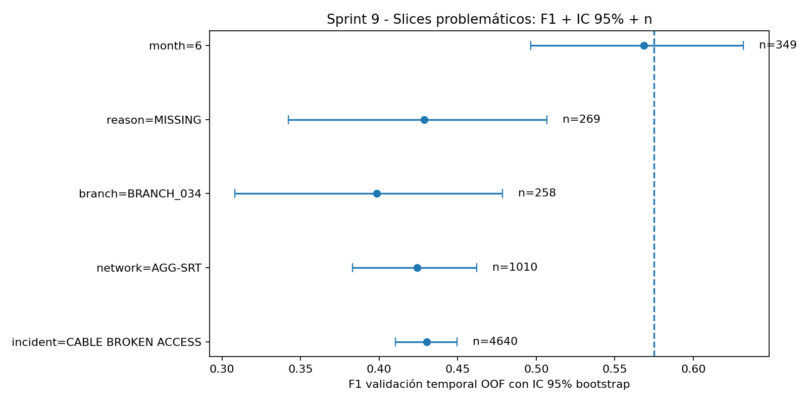
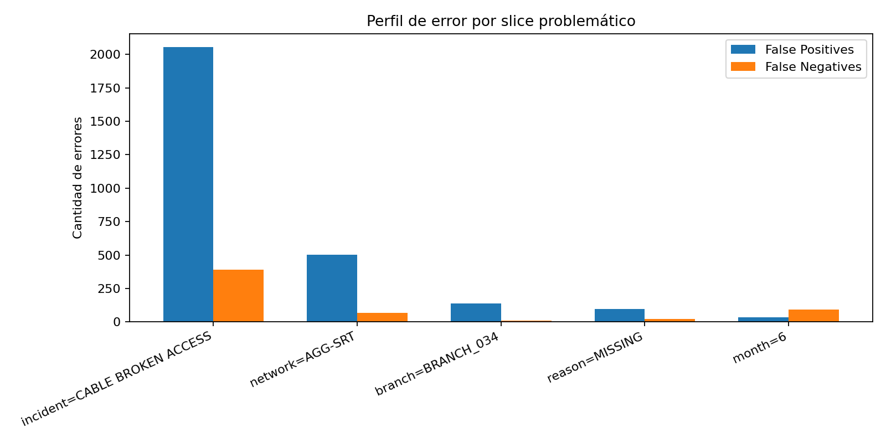
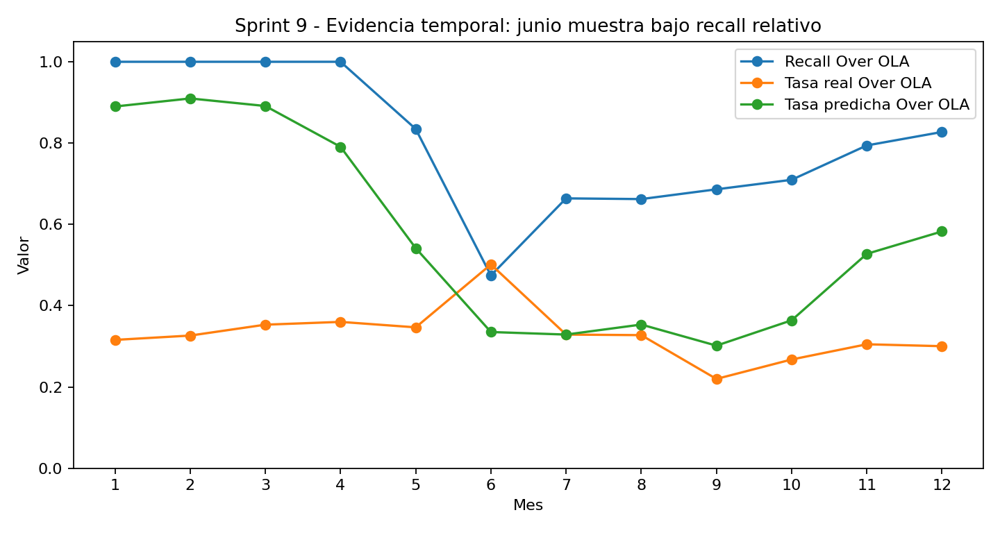

# Sprint 9 - Análisis de errores por slices y plan de mitigación

## 1. Resumen del avance

Este sprint incorpora un análisis de errores por slices sobre el pipeline experimental desarrollado hasta Sprint 8. El propósito es pasar de una evaluación global del modelo a un diagnóstico más específico de sus fallos, identificando subpoblaciones donde el desempeño disminuye o donde el perfil de error puede afectar la utilidad operativa del sistema.

En el contexto del proyecto, el modelo busca apoyar la priorización temprana de incidentes NOC TX/IP con riesgo de superar OLA/SLA. Por ello, no basta con reportar una métrica promedio; también es necesario identificar en qué segmentos el modelo genera más falsos positivos o falsos negativos, estimar la estabilidad de la métrica mediante intervalos de confianza y proponer acciones de mitigación.

El análisis se enfoca en cinco elementos por cada slice problemático:

- Tamaño de muestra (`n`).
- Métrica principal e intervalo de confianza.
- Falsos positivos y falsos negativos.
- Causa probable basada en evidencia.
- Plan de mitigación para la siguiente iteración.

## 2. Base del análisis

El análisis toma como punto de partida el pipeline trabajado hasta Sprint 8:

| Elemento | Configuración utilizada |
|---|---|
| Proyecto | Detección proactiva de fallas físicas en infraestructura de red NOC |
| Variable objetivo | `label_over_ola` |
| Clases | `Over OLA` y `On Time` |
| Modelo base | `GradientBoostingClassifier` |
| Preprocesamiento | `OrdinalEncoder` + `SimpleImputer` |
| Validación | `TimeSeriesSplit(n_splits=3)` |
| Semilla | `42` |
| Métrica principal | F1 para la clase crítica `Over OLA` |
| Umbral de decisión | `decision_threshold = 0.2304` |

El objetivo operativo se mantiene: detectar tempranamente incidentes con riesgo de incumplir OLA/SLA, evitando fuga temporal de información y manteniendo trazabilidad del proceso experimental.

## 3. Metodología de error slicing

El error slicing consiste en evaluar el desempeño del modelo sobre subpoblaciones específicas. En este sprint se analizan slices asociados a variables operativas, topológicas, temporales y de calidad de datos.

El procedimiento aplicado fue el siguiente:

1. Ordenar los incidentes por fecha de inicio del evento.
2. Generar predicciones out-of-fold usando `TimeSeriesSplit(n_splits=3)`.
3. Entrenar el pipeline en datos pasados y validar sobre ventanas futuras.
4. Aplicar el umbral de decisión documentado para clasificar `Over OLA`.
5. Calcular métricas por slice: F1, precision, recall, tamaño de muestra, positivos reales y matriz de confusión.
6. Calcular intervalos de confianza al 95% mediante bootstrap para los slices seleccionados.
7. Interpretar cada slice en función del tipo de error dominante y proponer un plan de mitigación.

El uso de intervalos de confianza permite distinguir entre errores observados de forma estable y variaciones que pueden ser inestables por tamaño de muestra reducido.

## 4. Resultado global y slices problemáticos

La referencia global de validación out-of-fold presenta un F1 aproximado de `0.575` para la clase `Over OLA`. A partir del análisis por subpoblaciones, se identificaron cinco slices problemáticos o relevantes para la mejora del pipeline.

| Slice problemático | n | Positivos Over OLA | F1 con IC 95% | Precision con IC 95% | Recall con IC 95% | Matriz de confusión |
|---|---:|---:|---|---|---|---|
| Global OOF | 8112 | 2630 | 0.575 [0.562, 0.588] | 0.434 [0.420, 0.448] | 0.851 [0.839, 0.864] | TP=2239, FP=2921, FN=391, TN=2561 |
| `incident_type = CABLE BROKEN ACCESS` | 4640 | 1313 | 0.430 [0.410, 0.450] | 0.310 [0.292, 0.328] | 0.703 [0.679, 0.727] | TP=923, FP=2053, FN=390, TN=1274 |
| `network_type = AGG-SRT` | 1010 | 276 | 0.424 [0.383, 0.462] | 0.294 [0.259, 0.327] | 0.761 [0.711, 0.808] | TP=210, FP=504, FN=66, TN=230 |
| `branch_id = BRANCH_034` | 258 | 58 | 0.398 [0.308, 0.478] | 0.261 [0.192, 0.324] | 0.845 [0.745, 0.936] | TP=49, FP=139, FN=9, TN=61 |
| `reason_group = MISSING` | 269 | 67 | 0.429 [0.342, 0.507] | 0.315 [0.239, 0.393] | 0.672 [0.550, 0.780] | TP=45, FP=98, FN=22, TN=104 |
| `month = 6` | 349 | 175 | 0.568 [0.497, 0.632] | 0.709 [0.630, 0.792] | 0.474 [0.400, 0.542] | TP=83, FP=34, FN=92, TN=140 |

## 5. Lectura general de resultados

Los resultados muestran que el desempeño global no se distribuye de manera uniforme. Existen slices con degradación clara en F1 y con perfiles de error distintos.

En `CABLE BROKEN ACCESS`, `AGG-SRT`, `BRANCH_034` y `reason_group = MISSING`, el problema predominante es la sobre-alerta. Es decir, el modelo clasifica muchos casos como `Over OLA`, pero una parte importante termina siendo `On Time`. Esto se observa en la cantidad elevada de falsos positivos.

En cambio, en `month = 6` el problema principal cambia: el modelo presenta más falsos negativos. Este patrón es más delicado desde el punto de vista operativo, porque implica incidentes que podrían superar OLA/SLA y que no serían priorizados oportunamente.

## 6. Evidencia visual

### 6.1 F1 por slice con intervalo de confianza



### 6.2 Falsos positivos y falsos negativos por slice



### 6.3 Análisis temporal mensual



## 7. Causa probable, evidencia y plan de mitigación por slice

### 7.1 `incident_type = CABLE BROKEN ACCESS`

Este slice concentra un volumen alto de incidentes y presenta un F1 menor que la referencia global. La cantidad de falsos positivos y falsos negativos indica que el tipo de incidente por sí solo no es suficiente para diferenciar correctamente los casos `Over OLA` y `On Time`.

**Causa probable:** el comportamiento de los cortes de cable depende de condiciones adicionales como topología, branch operativo, causa específica, horario de ocurrencia, disponibilidad de atención y recurrencia histórica del incidente.

**Evidencia:** el slice tiene `n = 4640`, F1 de `0.430 [0.410, 0.450]`, precision de `0.310`, recall de `0.703`, `FP = 2053` y `FN = 390`.

**Plan de mitigación:** crear variables de historial operativo por tipo de incidente, branch y topología; incorporar conteos rolling de incidentes similares; separar este tipo de incidente por `reason_group` y `network_type`; y calibrar el umbral para reducir falsos positivos sin perder demasiados casos `Over OLA`.

### 7.2 `network_type = AGG-SRT`

El slice asociado a `AGG-SRT` muestra bajo F1 y una cantidad elevada de falsos positivos. Esto sugiere que el modelo puede estar asociando esta topología con mayor riesgo de `Over OLA`, aunque no todos los casos terminan superando el OLA.

**Causa probable:** la topología `AGG-SRT` puede tener una distribución distinta del resto de la base, combinándose con tipos de incidentes frecuentes que inducen sobre-alerta.

**Evidencia:** el slice tiene `n = 1010`, F1 de `0.424 [0.383, 0.462]`, precision de `0.294`, recall de `0.761`, `FP = 504` y `FN = 66`.

**Plan de mitigación:** evaluar calibración por `network_type`, ajustar threshold según costo operativo por topología y crear variables de historial reciente por combinación `network_type` × `branch_id`.

### 7.3 `branch_id = BRANCH_034`

El desempeño disminuye en un branch operativo anonimizado. Este resultado evidencia variabilidad operacional entre branches y la posibilidad de que algunas zonas tengan patrones locales distintos.

**Causa probable:** el branch puede presentar diferencias en tiempos de atención, volumen de incidentes, calidad de registro o patrones históricos que no son capturados completamente por el modelo global.

**Evidencia:** el slice tiene `n = 258`, F1 de `0.398 [0.308, 0.478]`, precision de `0.261`, recall de `0.845`, `FP = 139` y `FN = 9`.

**Plan de mitigación:** aplicar validación robusta por grupos, como Group Split o Leave-One-Group-Out por `branch_id`; revisar la distribución histórica del branch; y evaluar thresholds específicos solo si existe tamaño mínimo suficiente.

### 7.4 `reason_group = MISSING`

Los registros sin grupo de razón muestran bajo desempeño. Este slice refleja un problema de completitud o calidad de datos que reduce la señal explicativa disponible para el modelo.

**Causa probable:** la ausencia de `reason_group` elimina información causal relevante para distinguir incidentes `Over OLA` y `On Time`.

**Evidencia:** el slice tiene `n = 269`, F1 de `0.429 [0.342, 0.507]`, precision de `0.315`, recall de `0.672`, `FP = 98` y `FN = 22`.

**Plan de mitigación:** crear una variable indicadora `missing_reason_group`, mejorar reglas de imputación, revisar la normalización de categorías de causa y evitar mezclar valores faltantes con causas reales.

### 7.5 `month = 6`

El slice temporal correspondiente al mes 6 muestra un patrón distinto al resto. Aunque la precision es relativamente mayor, el recall disminuye, lo que indica más falsos negativos.

**Causa probable:** posible cambio temporal en la distribución de incidentes, carga operativa, estacionalidad o variación en los procesos de atención.

**Evidencia:** el slice tiene `n = 349`, F1 de `0.568 [0.497, 0.632]`, precision de `0.709`, recall de `0.474`, `FP = 34` y `FN = 92`.

**Plan de mitigación:** aplicar backtesting mensual, monitorear drift temporal, recalibrar el threshold por ventana temporal y confirmar si el patrón se repite en meses posteriores.

## 8. Plan general de mitigación

| Línea de mitigación | Acción propuesta | Evidencia esperada |
|---|---|---|
| Calibración y threshold | Probar thresholds entre 0.20 y 0.50 y optimizar una función de costo operativo. | Tabla baseline vs mitigación con F1, precision, recall, FP, FN y costo esperado. |
| Nuevas features por slice | Crear conteos rolling por `branch_id`, `network_type`, `incident_type` y ventanas de 7, 14 y 30 días. | Reducción de errores en slices dominantes y mejora de estabilidad temporal. |
| Tratamiento de datos faltantes | Crear indicadores explícitos para `reason_group` faltante y duración faltante. | Mejora en slices con valores `MISSING` y reducción de ambigüedad en imputación. |
| Validación robusta | Complementar `TimeSeriesSplit` con Group/LOGO por branch y backtesting mensual. | Tabla de degradación por branch o ventana temporal. |
| Monitoreo temporal | Medir target rate, pred rate, recall y precision por mes. | Identificación temprana de drift y necesidad de recalibración. |

## 9. Experimento mínimo propuesto para la siguiente iteración

La siguiente iteración debe comparar el baseline actual contra una mitigación controlada, manteniendo el mismo split, la misma semilla y el mismo conjunto de validación.

**Hipótesis de mitigación:** un ajuste de threshold basado en costo operativo reduce falsos positivos en slices de sobre-alerta sin disminuir el recall global de `Over OLA` más de tres puntos porcentuales.

**Diseño propuesto:**

1. Mantener el pipeline base del Sprint 8.
2. Evaluar thresholds entre `0.20` y `0.50`.
3. Usar una función de costo inicial: `costo = 3*FN + 1*FP`, priorizando no perder casos `Over OLA`.
4. Reportar tabla baseline vs mitigación.
5. Comparar métricas globales y por slice.
6. Confirmar que la mitigación no mejora un slice a costa de degradar excesivamente el desempeño global.

## 10. Archivos de evidencia sugeridos en el repositorio

La evidencia de este sprint debe quedar organizada de la siguiente manera:

```text

docs/
└── sprint9_error_slicing_report.md

results/
├── problematic_slices_sprint9.csv
├── slice_mitigation_plan_sprint9.csv
├── fig_problematic_slices_f1_ci_sprint9.png
├── fig_problematic_slices_fp_fn_sprint9.png
└── fig_monthly_recall_shift_sprint9.png
```

## 11. Conclusión

El análisis de este sprint permite identificar dónde falla el modelo y por qué esos errores son relevantes para el objetivo operativo del proyecto. Los slices problemáticos no solo muestran menor desempeño, sino también perfiles de error distintos: algunos concentran falsos positivos, mientras que el slice temporal del mes 6 concentra falsos negativos.

Con este avance, el proyecto fortalece su trazabilidad experimental y genera un plan de mejora concreto para la siguiente iteración: calibración, ajuste de threshold, nuevas variables por historial operativo, tratamiento explícito de datos faltantes y validación robusta por tiempo y branch operativo.
